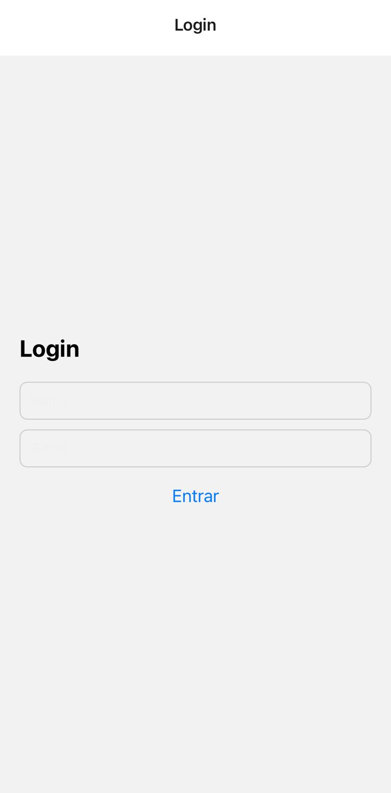
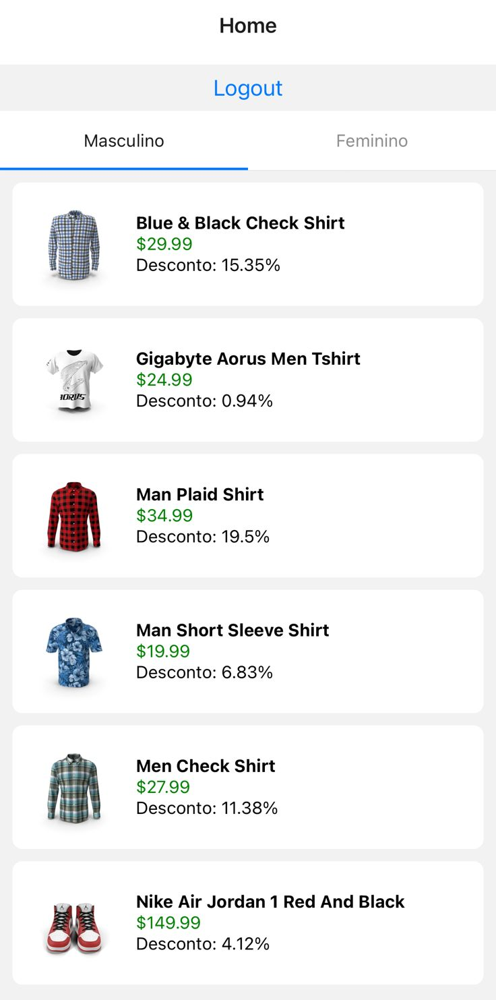
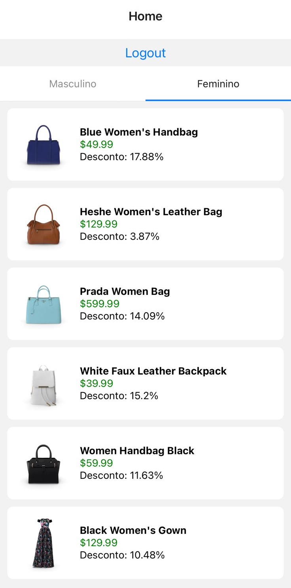
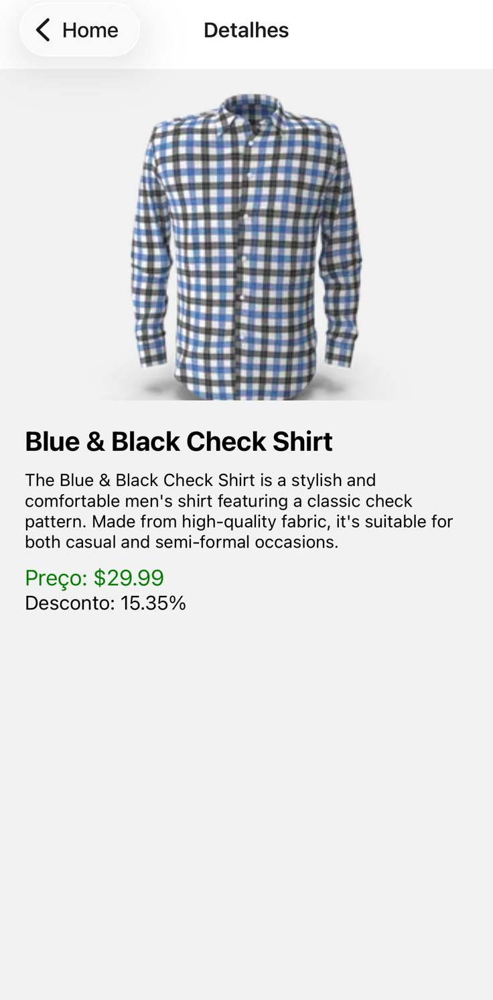

# Catálogo Interativo Mobile com React Native e Expo

Aplicativo mobile desenvolvido em React Native com Expo para apresentar produtos de uma loja online. O aplicativo consome dados de uma API REST utilizando Axios e organiza os produtos por categorias masculinas e femininas.

## Funcionalidades

- Tela de login com validação de campos
- Armazenamento temporário do usuário com Redux Toolkit
- Listagem de produtos por categoria
- Abas Masculino e Feminino
- Consumo de API REST com Axios
- Tela de detalhes do produto com imagem, descrição, preço e desconto
- Logout funcional

## Tecnologias utilizadas

- React Native
- Expo
- Axios
- Redux Toolkit
- React Redux
- React Navigation

## Estrutura do projeto

```bash
src/
├ components
├ screens
├ navigation
├ services
├ data
└ store
```

## Como executar o projeto

## Como executar o projeto

### Pré-requisitos

Antes de executar o projeto, é necessário ter instalado:

- Node.js (versão LTS recomendada)  
  https://nodejs.org

- Expo Go no celular  
  - Android: https://play.google.com/store/apps/details?id=host.exp.exponent  
  - iOS: https://apps.apple.com/app/expo-go/id982107779

### Passos para executar

1. Clonar o repositório
   ```bash
   git clone https://github.com/igor-rgomes/catalogo-mobile-react-native.git
   ```
2. Entrar na pasta do projeto
    ```bash
   cd catalogo-mobile-react-native
   ```
3. Instalar as dependências do projeto
    ```bash
   npm install
   ```
4. Executar o projeto
    ```bash
   npx expo start
   ```
5. Abrir no celular
    ```bash
    - Abra o aplicativo **Expo Go**
    - Escaneie o **QR Code** exibido no terminal ou no navegador
   ```

## API utilizada
```bash
https://dummyjson.com
```

## Prints do aplicativo

### Tela de Login


### Listagem Masculino


### Listagem Feminino


### Tela de Detalhes


## Autor
Igor Gomes
